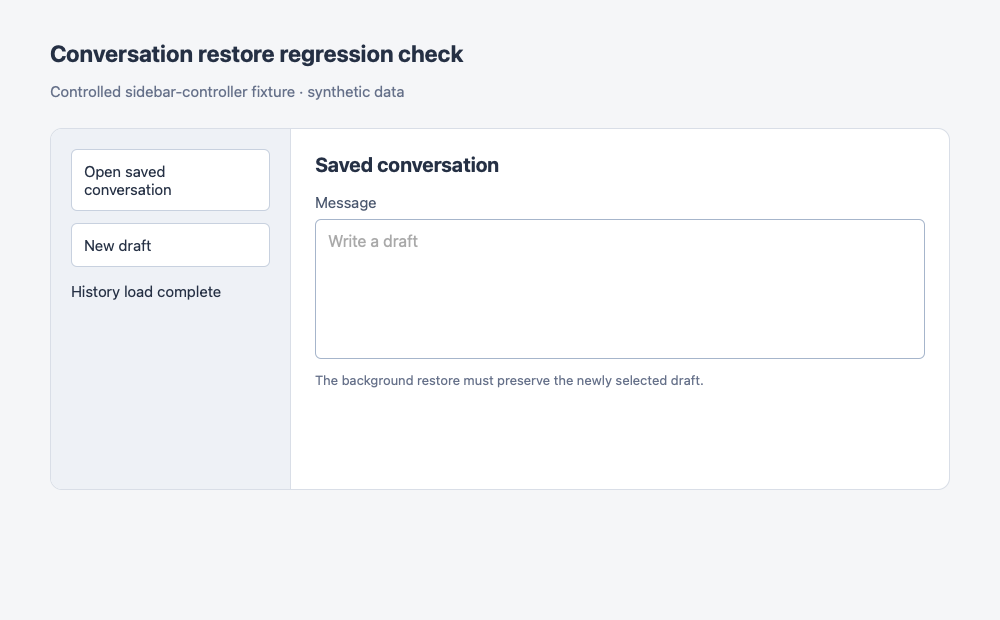
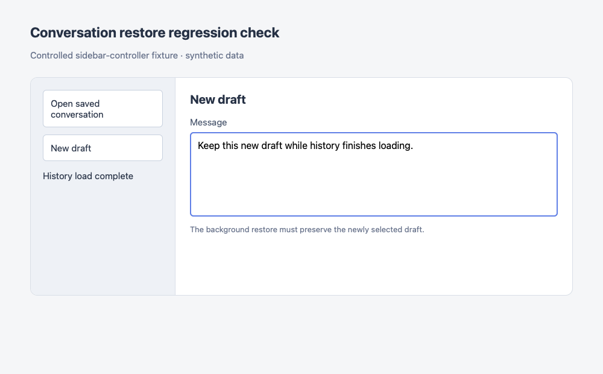

# PR review follow-up — 15 September 2026

## PR feedback

- Corrected the components README's relative link to the B3 evidence; the target now resolves within the repository.
- The historical bundle runner now requires the audited UI/build inputs at `1a648b183`, accepts a separate checkout via `--root`, and records baseline/checkout commit IDs. The audit documents installing and building a separate baseline worktree. All four variants (`baseline`, `logos`, `splash`, `combined`) build successfully there; all reject this optimized checkout before Vite starts. The existing logo and splash override assertions pass.

## Independent review

A separate agent reviewed `1a648b183..05747c8b7` without reading the PR feedback or audit conclusions. It found one verified issue:

**P2 — A late history restore could replace a newly selected draft.** Desktop startup improvements permit New Conversation while an earlier session is still loading. The native command creates the draft outside the sidebar controller, leaving the older open operation's generation current. Completing that operation selected the older conversation again, interrupting the new editor. Previously, the loading gate prevented this sequence.

The controller now also checks that the originally selected conversation remains active before applying the completed restore. A full `DesktopPanel` integration test follows the real sidebar load callback and native New Conversation event. It failed before the fix (the composer returned to `old-session`) and passes after, preserving the draft's editor identity, text, and focus.

No other verified issues or reportable suspicions were found. The independent review ran 179 focused tests successfully. Its VS Code test attempt was blocked during `tsx` initialization by a sandbox IPC restriction; it did not perform native host execution, a fresh VSIX build, or Go tests.

## Follow-up validation

- 108 assistant shell/runtime/focus tests and 62 sidebar/chat tests pass after the fix.
- Feature type checking reports zero errors/warnings; focused production lint and formatting pass.
- A headless Chromium/WebKit fixture imports the actual Svelte sidebar controller and uses synthetic repositories. Before the fix, a delayed restore changes selection back to the saved conversation. After the fix, the new draft, its text, and focus remain intact. Neither browser reports page errors. [Results](review-navigation-results.json).
- The browser fixture illustrates controller behavior with synthetic UI. Spoolside reports its server unavailable, so this follow-up does not establish native compositor behavior.

| WebKit before                                                                   | WebKit after                                                           |
| ------------------------------------------------------------------------------- | ---------------------------------------------------------------------- |
|  |  |
