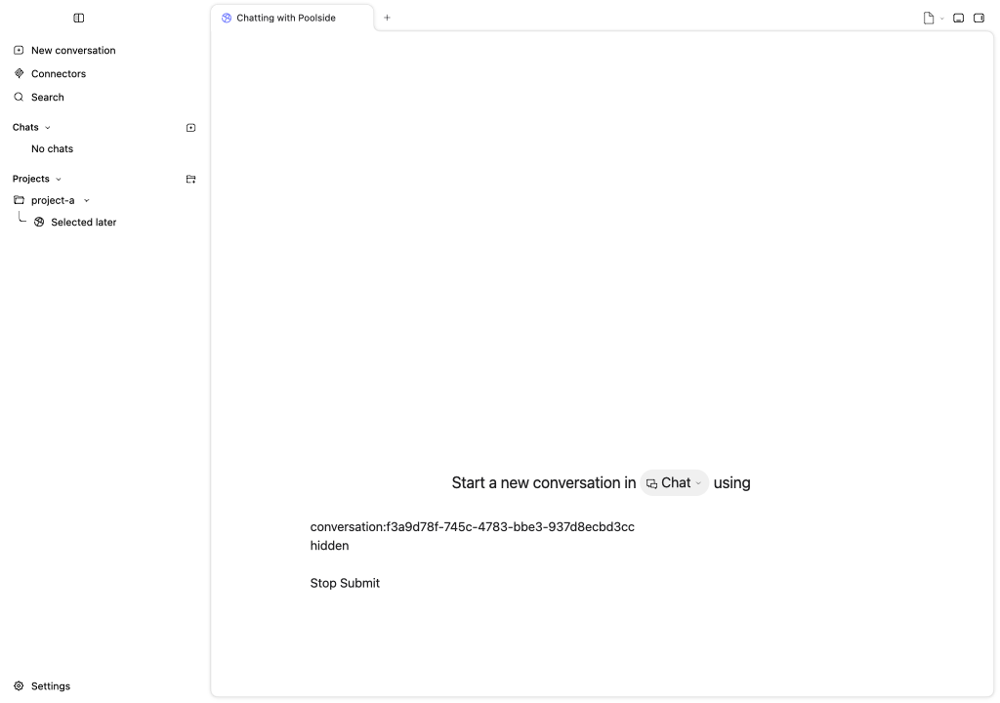
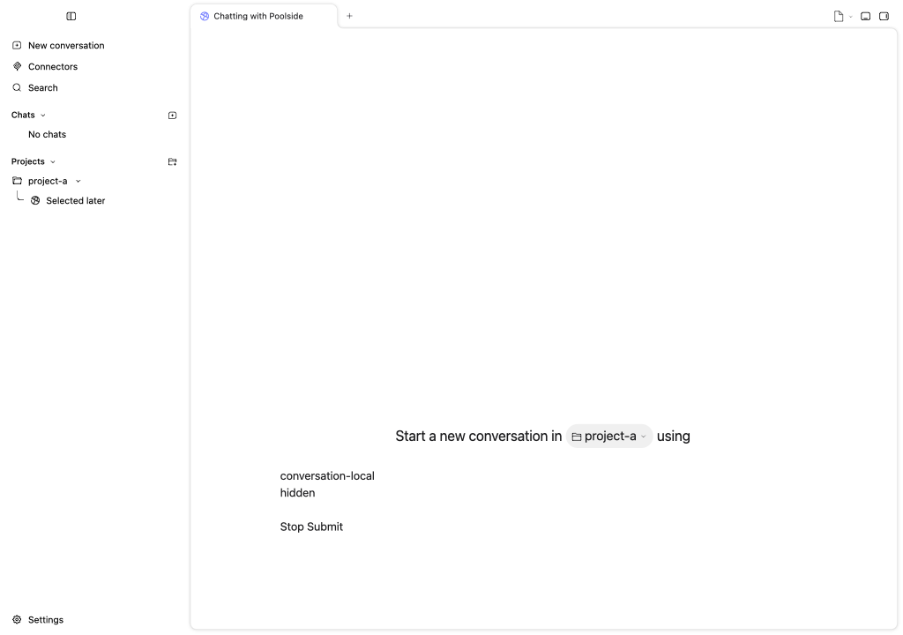
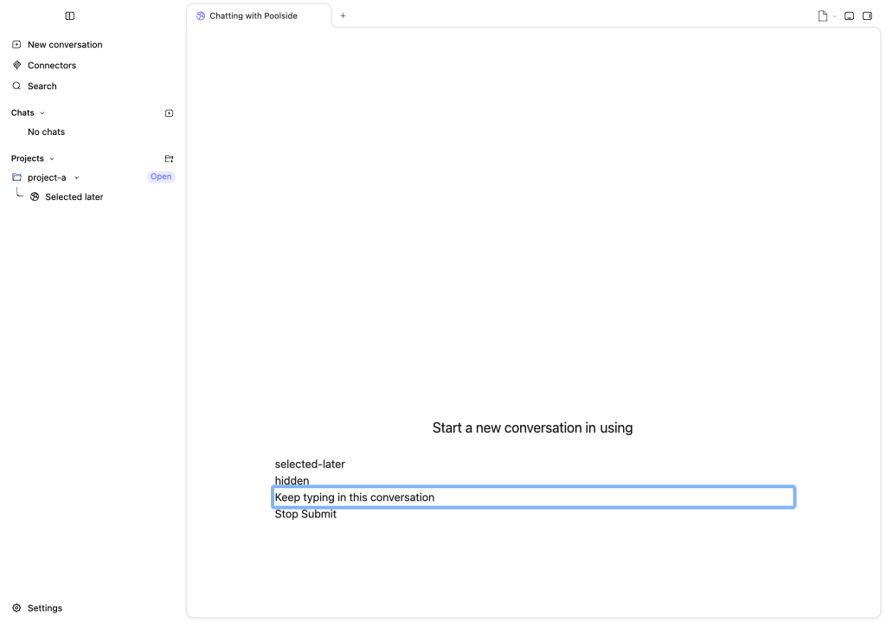

# PR review follow-up — 16 September 2026

The remaining review thread identified two related navigation races in `DesktopRuntime`: New Chat awaits its working directory, and New Conversation can await agent discovery. Either continuation could create and select a draft after the user had selected another conversation or opened Settings.

Both continuations now check the active conversation, view, and project-settings path before changing session state. A request generation also prevents an older New command from winning while a newer command is still pending. Cancelled requests return the existing `null` result without creating, persisting, focusing, or selecting a stale draft. Normal immediate creation, reuse of an empty draft, and an explicitly requested chat opened from Settings keep their existing behavior.

## Before and after

Baseline: `82080dfbaa66ebd9e7af925b5d906fb8d57e76f9`.

- Before the fix, nine new runtime regression cases fail. The positive control (an explicit chat request from Settings with both prerequisites delayed) passes.
- Both new full `DesktopPanel` integration cases fail before the fix: completing a delayed directory or discovery request creates an unwanted session after the user selects another conversation.
- After the fix, all **120** focused shell, runtime, bootstrap, and focus tests pass. The integration assertions preserve the selected conversation, editor identity, text, and focus, and verify that no additional session is created.
- The same two panel cases were run in headless **WebKit and Chromium**. Both fail with the baseline runtime and pass with the fixed runtime; the final runs report no unhandled browser errors.
- Assistant type checking reports zero errors and zero warnings with the repository's usual Svelte warning exclusions. Production-file lint and formatting pass.

Focused regression command:

```sh
pnpm -F @poolsideai/assistant test:unit \
  src/acp/runtime/DesktopRuntime.svelte.test.ts \
  src/acp/DesktopPanel.test.ts \
  src/acp/runtime/shared/PendingSessionBootstrap.test.ts \
  src/shared/Helpers.test.ts
```

## Browser evidence

These are the actual panel and runtime with synthetic repositories and the existing test prompt component, not a native application session. The temporary Vitest browser configuration supplies browser/module resolution, test cleanup, and the host/focus mocks needed by the existing JSDOM suite; it substitutes only the baseline runtime for the before runs. The simple editor exposes the selected conversation ID and test text directly.

| Delayed prerequisite | Before: late draft replaces the editor | After: selection, text, and focus remain |
| --- | --- | --- |
| Chat directory |  |  |
| Agent discovery |  |  |

Spoolside has no running target for this worktree, and its skill prohibits starting one automatically. This follow-up therefore does not establish native compositor behavior. The Desktop smoke-test build at `82080dfba` predates this fix.

## Tab label descenders

The tab title inherited `line-height: 1` while clipping overflow for ellipsis. That line box cut off the bottom of the `g` in “Chatting with Codex”. Setting `line-height: normal` on the title span preserves the font's full glyph height, including in the drag preview.

A before/after render of the actual tab component in WebKit and Chromium covers desktop, compact, large, and enlarged-text sizes. Comparing each title with its unclipped reference finds 6–18 missing pixels before and zero after at 2× scale. Tab-bar dimensions are unchanged; long labels retain ellipsis, and selecting and closing tabs still work. Split-package lint passes; type checking reports zero errors and one existing Storybook warning. Native spoolside validation remains unavailable.

| Before | After |
| --- | --- |
|  |  |
